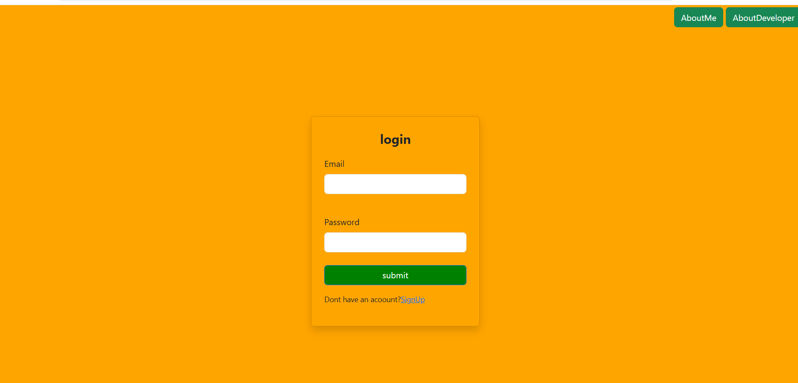
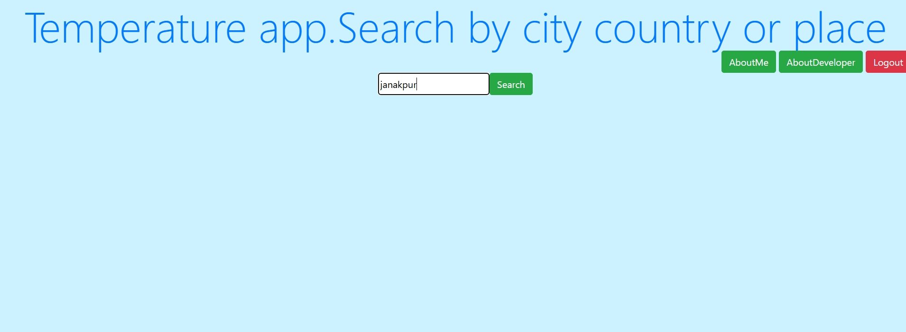
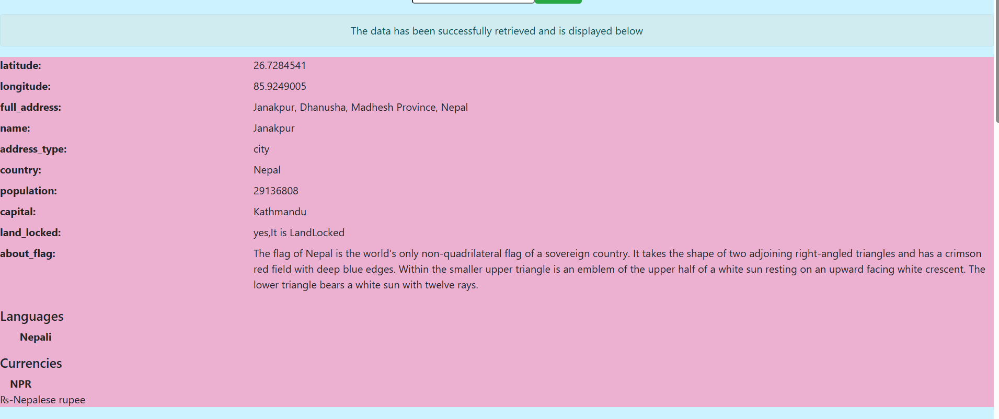
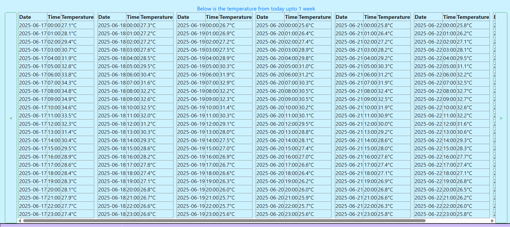

# 🌍 django_taapman

## Description
**django_taapman** is a Django-based web application that allows users to view detailed weather information for any location across the globe. The app uses geolocation and country data APIs to display temperature forecasts for 24 hours and 7 days, along with location details like country name, capital, and more. User registration is required to access the full functionality of the app.

## Table of Contents
- [Features](#features)
- [Technologies Used](#technologies-used)
- [APIs Used](#apis-used)
- [Installation](#installation)
- [Screenshots](#screenshots)
- [License](#license)
- [Author](#author)


## Features
- 🌦️ 24-hour and 7-day temperature forecasts for any location.
- 🗺️ Country details like name, capital, region, population, and more.
- 📍 Search using city/location name via OpenStreetMap (Nominatim).
- 🔐 User signup and authentication required for access.
- 👤 Displays personal user details after login.
- 🧭 Clean and user-friendly interface.

## 📸 Screenshots

### 🔐 1. Login Page


---

### 👤 2. About Me Section


---

### 👨‍💻 3. About Developer Section


---

### 🔍 4. Search Box for Location


---

### 🗺️ 5. Place Details (Country, Capital, etc.)


---

### 🌡️ 6. Temperature Forecast (24-hour & 7-day)


---

### 🏳️ 7. Flag and Coat of Arms


## Technologies Used
- **Backend**: Django (Python)
- **Frontend**: HTML, CSS,Bootstrap JavaScript
- **Editor**: Visual Studio Code
- **Database**: SQLite (default)

---

## APIs Used
- 🌍 **[Nominatim (OpenStreetMap)](https://nominatim.openstreetmap.org/)** – To convert location names into geographical coordinates (geocoding).
- 🏳️ **[REST Countries API](https://restcountries.com/#endpoints-code)** – To retrieve information about countries (name, capital, population, etc.).

---

## ✍️ Author

**Nitish Kumar Bubna**  
Developer of `django_taapman`, passionate about building practical and informative web applications with clean design and real-world APIs.

- 💼 GitHub: [@nitishdotdot](https://github.com/nitishdotdot)
- 📧 Email: your.nitishdotdot@gmail.com

---

## Installation

1. **Clone the repository**
```bash
git clone https://github.com/nitishdotdot/django_taapman.git
cd django_taapman
